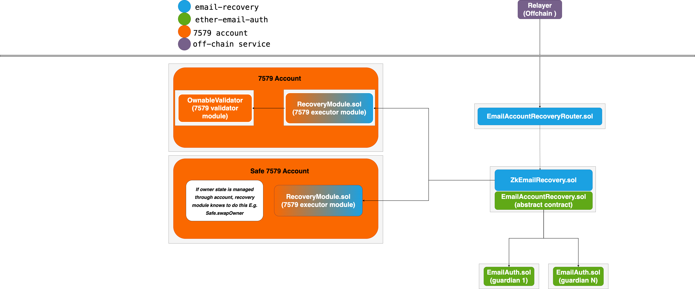

## ZK Email Recovery

## Overview
Account recovery has traditionally been one of the most complex UX hurdles that account holders have to contend with. The ZK Email Recovery contracts provide a robust and simple mechanism for account holders to recover accounts via email guardians.

## Usage

### Install dependencies

```shell
pnpm install
forge install
```

### Build

```shell
forge build
```

### Test

```shell
forge test
```

# ZK Email Recovery

## High level contracts diagram (WIP).


## Core contracts
The core contracts contain the bulk of the recovery logic.

### EmailRecoveryManager.sol

`EmailRecoveryManager.sol` defines a default implementation for email-based recovery. It is designed to provide the core logic for email based account recovery that can be used across different modular account implementations. For the end user, the core `EmailRecoveryManager` contract aims to provide a robust and simple mechanism to recover accounts via email guardians.

It inherits from a zk email contract called `EmailAccountRecovery.sol` which defines some basic recovery logic that interacts with lower level zk email contracts. `EmailAccountRecovery.sol` holds the logic that interacts with the lower level zk email contracts EmailAuth.sol, verifier, dkim registry etc. More info on the underlying EmailAccountRecovery.sol contract: https://github.com/zkemail/ether-email-auth/tree/main/packages/contracts#emailaccountrecovery-contract. 

The guardians are represented onchain by EmailAuth.sol instances. EmailAuth.sol is a lower level zk email contract. it is designed to authenticate that a user is a correct holder of the specific email address and authorize anything described in the email. The guardians privacy is protected onchain, for more info on zk email privacy and EmailAuth - see the [zk email docs](https://zkemail.gitbook.io/zk-email).

EmailRecoveryManager relies on a dedicated recovery module to execute a recovery attempt. This (EmailRecoveryManager) contract defines "what a valid recovery attempt is for an account", and the recovery module defines “how that recovery attempt is executed on the account”. One motivation for having the 7579 recovery module and the core ZkEMailRecovery contract being seperated is to allow the core recovery logic to be used across different account implementations and module standards. The core `EmailRecoveryManager.sol` contract is designed to be account implementation agnostic. It's functionality can be extended by creating new subject handler contracts such as `EmailRecoverySubjectHandler.sol`. TODO add more info on this

## EmailRecoveryManager flow walkthrough

The core functions that must be called in the end-to-end flow for recovery are
1. configureRecovery (does not need to be called again for subsequent recovery attempts)
2. handleAcceptance - called for each guardian. Defined on EmailAccountRecovery.sol, calls acceptGuardian in this contract
3. handleRecovery - called for each guardian. Defined on EmailAccountRecovery.sol, calls processRecovery in this contract
4. completeRecovery

Before proceeding, ensure that the following components are correctly set up before deploying a EmailRecoveryManager instance:
- verifierAddr: Address of the ZKP verifier.
- dkimAddr: Address of the DKIM registry for email authentication.
- emailAuthImplementationAddr: Address of the email authentication implementation.
- subjectHandler: Address of the email subject handler.

### Configure Recovery
After deployment, this is the first core function in the recovery flow, setting up the recovery module, guardians, guardian weights, threshold, and delay/expiry. It only needs to be called once. The threshold must be set appropriately to balance security and usability. The same goes for the delay and expiry - there is a minimum recovery window time that protects against an account giving itself a prohibitively small window in which to complete a recovery attempt.

It is strongly recommended that configureRecovery is called during the installation phase of the recovery module. This ensures that a user cannot forget to install the recovery module and end up with a broken recovery config.

```ts
function configureRecovery(
    address[] memory guardians,
    uint256[] memory weights,
    uint256 threshold,
    uint256 delay,
    uint256 expiry
) external;
```

### Handle Acceptance
This function handles the acceptance of each guardian. Each guardian must accept their role to be a part of the recovery process. This is an important step as it ensures that the guardian consents to the responsibility of being a guardian for a specific account, and protects against typos from entering a guardian email address. Such a typo would render the guardian unusable. handleAcceptance must be called for each guardian until the threshold is reached.

```ts
function handleAcceptance(
    address guardian,
    uint256 templateIdx,
    bytes[] memory subjectParams,
    bytes32
) internal;
```

### Handle Recovery
This function processes each guardian's recovery request. A Guardian can initiate a recovery request by replying to an email. The contract verifies the guardian's status and checks if the threshold is met. Once the threshold is met and the delay has passed, anyone can complete the recovery process. The recovery delay is a security feature that gives the wallet owner time to react to a recovery attempt in case of a malicious guardian or guardians. This is possible from guardians who act maliciously, but also from attackers who have gotten access to a guardians email address. Although since guardian email privacy is preserved on chain, this reduces the attack surface further since someone with access to a someone elses email account would not know if the email address is used in a recovery setup, or if they did, which account to target. There is also an expiry time, which once expires, invalidates the recovery attempt. This encourages timely execution of recovery attempts and reduces the attack surface that could result from recovery attempts that have been stagnent and uncompleted for long periods of time.

```ts
function handleRecovery(
    address guardian,
    uint256 templateIdx,
    bytes[] memory subjectParams,
    bytes32
) internal;
```

### Complete Recovery
The final function to complete the recovery process. This function completes the recovery process by validating the recovery request and triggering the recovery module to perform the recovery on the account itself.

```ts
function completeRecovery(address account) public;
```

### EmailRecoverySubjectHandler.sol
TODO add section

### SafeRecoverySubjectHandler.sol
TODO update section
~~`SafeZkEmailRecovery.sol` is an extension of `EmailRecoveryManager.sol` that implements recovery for Safe accounts. It provides a good example of how to extend `EmailRecoveryManager.sol` for different account implementations. The contract follows the same multi-step process that EmailRecoveryManager.sol does, where guardians must first be accepted before they can initiate recovery. The Safe example does not override the acceptance related functions, only the recovery ones. This is because the acceptance subject is broad enough that it can stay the same whereas the recovery attempt subject needs additional info in order to complete the recovery request properly. This will be a common scenario where only the recovery subject-related functions will need overriding. A scenario in which you would definitely need to update both is if you wanted to provide email recovery functionality to users who didn't speak English. In which case you could translate the required subjects into the chosen language~~

## How you can extend EmailRecoveryManager by adding a custom template

~~When you know what recovery specific information you need, you can create a new contract, inherit from `EmailRecoveryManager.sol` and extend the relevant functions - note you only have to extend ones that are relevant:~~
* `acceptanceSubjectTemplates()`
* `validateAcceptanceSubjectTemplates()`

* `recoverySubjectTemplates()`
* `validateRecoverySubjectTemplates()`

~~These functions, and the functions to validate the subject params are virtual so they can be overridden if a developer wants to change the subjects for a different implementation. A good example of this would be this code to add Safe compatibility (Safe recovery requires slightly different args in the subject). The account developer can choose any subject that they want if they override the default implementation. Here is some more info on subject params:~~

With an email subject of:
```bash
Recover account 0x50Bc6f1F08ff752F7F5d687F35a0fA25Ab20EF52 to new owner 0x7240b687730BE024bcfD084621f794C2e4F8408f using recovery module 0x344433E549E3F84B68D1aAC5b416Ac5cE2Be1063
```

Where the first address in the subject is accountAddress, second the oldOwner, third newOwner and forth the recoveryModule address

The subject params would be:

```ts
bytes[] memory subjectParamsForRecovery = new bytes[](3);
subjectParamsForRecovery[0] = abi.encode(accountAddress);
subjectParamsForRecovery[1] = abi.encode(newOwner);
subjectParamsForRecovery[2] = abi.encode(recoveryModule);
```

### What can I add to a subject template?
A subject template defines the expected format of the message in the Subject for each recovery implementation. It allows developers to constrain that message to be in the application-specific format without writing new ZKP circuits. The use of different subject templates in this case allows for a flexible and extensible mechanism to define recovery messages, making it adaptable to different modular account implemtations.

The subject template is an array of strings, each of which has some fixed strings without space and the following variable parts:
- `"{string}"`: a string. Its Solidity type is `string`.
- `"{uint}"`: a decimal string of the unsigned integer. Its Solidity type is `uint256`.
- `"{int}"`: a decimal string of the signed integer. Its Solidity type is `int256`.
- `"{decimals}"`: a decimal string of the decimals. Its Solidity type is `uint256`. Its decimal size is fixed to 18. E.g., “2.7” ⇒ `abi.encode(2.7 * (10**18))`.
- `"{ethAddr}"`: a hex string of the Ethereum address. Its Solidity type is `address`. Its value MUST satisfy the checksum of the Ethereum address.

If you are recovering an account that needs to rotate a public key which is of type `bytes` in solidity, you can use the string type for that for the subject template.

### EmailRecoveryModule.sol
An recovery module that recovers any validator.

The `recover()` function on the module holds the core logic for the module. It defines “how a recovery attempt is executed on the account”. This function must be called from the trusted recovery contract. The function that calls `recover()` from `EmailRecoveryManager.sol` is `completeRecovery()` which can be called by anyone, but normally the relayer. It is the final function that is called once a recovery attempt has been successful.

`completeRecovery()` calls into the account specific recovery module and can call executeFromExecutor to execute the account specific recovery logic. 

## Threat model
Importantly this contract offers the functonality to recover an account via email in a scenario where a private key has been lost. This contract does NOT provide an adequate mechanism to protect an account from a stolen private key by a malicious actor. This attack vector requires a holistic approach to security that takes specific implementation details of an account into consideration. For example, adding additional access control when cancelling recovery to prevent a malicious actor stopping recovery attempts, and adding spending limits to prevent account draining. This contract is designed to be extended to take these additional considerations into account, but does not provide them by default.