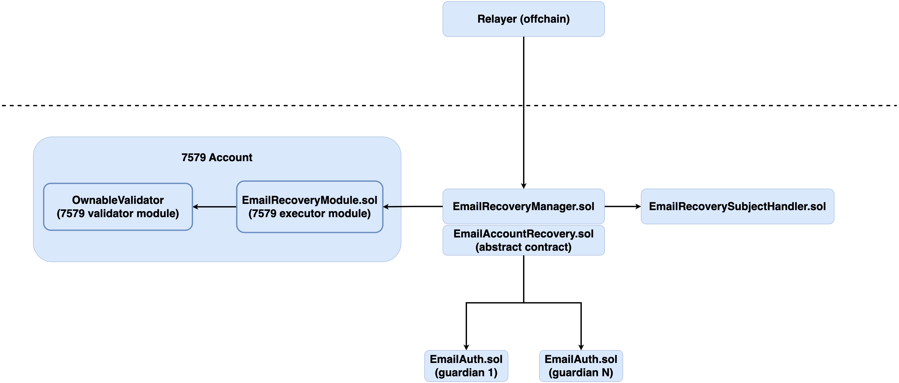

## ZK Email Recovery

## Overview
Account recovery has traditionally been one of the most complex UX hurdles that account holders have to contend with. The ZK Email Recovery contracts provide a robust and simple mechanism for account holders to recover modular accounts via email guardians.

Modular accounts get account recovery for 'free' by using our pre-deployed universal email recovery module. Since Safe's can be made 7579 compatible, the following contracts also support Safe account recovery out of the box too.

Modular account developers can easily integrate email recovery with richer and more specific email subjects by writing their own subject handler contracts, which are designed to be simple and contain the modular account-specific logic to recover an account.

## Usage

### Install dependencies

```shell
pnpm install
```

### Build

```shell
forge build
```

### Test

```shell
forge test
```

# ZK Email Recovery

## High level contracts diagram


Note: `EmailAccountRecovery.sol` & `EmailAuth.sol` can be found in the [ether-email-auth](https://github.com/zkemail/ether-email-auth) repo


### EmailRecoveryManager.sol

`EmailRecoveryManager.sol` defines the main logic for email-based recovery. It is designed to provide the core logic for email based account recovery that can be used across different modular account implementations. For the end user, the core `EmailRecoveryManager` contract aims to provide a robust and simple mechanism to recover accounts via email guardians.

It inherits from a zk email contract called `EmailAccountRecovery.sol` which defines some basic recovery logic that interacts with lower level zk email contracts. `EmailAccountRecovery.sol` holds the logic that interacts with the lower level zk email contracts `EmailAuth.sol`, verifier, dkim registry etc. More info on the underlying `EmailAccountRecovery.sol` contract can be found [here](https://github.com/zkemail/ether-email-auth/tree/main/packages/contracts#emailaccountrecovery-contract). 

The guardians are represented onchain by EmailAuth.sol instances. `EmailAuth.sol` is designed to authenticate that a user is a correct holder of the specific email address and authorize anything described in the email. The guardians privacy is protected onchain, for more info on zk email privacy and EmailAuth - see the [zk email docs](https://zkemail.gitbook.io/zk-email).

`EmailRecoveryManager` relies on a dedicated recovery module to execute a recovery attempt. The `EmailRecoveryManager` contract defines "what a valid recovery attempt is for an account", and the recovery module defines “how that recovery attempt is executed on the account”. One motivation for having the 7579 recovery module and the core `EmailRecoveryManager` contract being seperated is to allow the core recovery logic to be used across different account implementations and module standards. The core `EmailRecoveryManager.sol` contract is designed to be account implementation agnostic. It's functionality can be extended by creating new subject handler contracts such as `EmailRecoverySubjectHandler.sol`.

## EmailRecoveryManager flow walkthrough

The core functions that must be called in the end-to-end flow for recovery are
1. configureRecovery (does not need to be called again for subsequent recovery attempts)
2. handleAcceptance - called for each guardian. Defined on `EmailAccountRecovery.sol`, calls acceptGuardian in this contract
3. handleRecovery - called for each guardian. Defined on `EmailAccountRecovery.sol`, calls processRecovery in this contract
4. completeRecovery

Before proceeding, ensure that you deploy the email recovery contracts via one of the email recovery factories.

### Configure Recovery
After deployment, this is the first core function in the recovery flow, setting up the recovery module, guardians, guardian weights, threshold, and delay/expiry. It only needs to be called once. The threshold must be set appropriately to balance security and usability. The same goes for the delay and expiry - there is a minimum recovery window time that protects against an account giving itself a prohibitively small window in which to complete a recovery attempt.

`configureRecovery` is called during the installation phase of the recovery module. This ensures that a user cannot forget to install the recovery module, go to configure recovery, and end up with a broken recovery config.

```ts
function configureRecovery(
    address[] memory guardians,
    uint256[] memory weights,
    uint256 threshold,
    uint256 delay,
    uint256 expiry
) external;
```

### Handle Acceptance
This function handles the acceptance of each guardian. Each guardian must accept their role to be a part of the recovery process. This is an important step as it ensures that the guardian consents to the responsibility of being a guardian for a specific account, is in control of the specific email address, and protects against typos from entering the wrong email. Such a typo would render the guardian unusable. `handleAcceptance` must be called for each guardian until the threshold is reached.

```ts
function handleAcceptance(
    address guardian,
    uint256 templateIdx,
    bytes[] memory subjectParams,
    bytes32
) internal;
```

### Handle Recovery
This function processes each guardian's recovery request. A guardian can initiate a recovery request by replying to an email. The contract verifies the guardian's status and checks if the threshold is met. Once the threshold is met and the delay has passed, anyone can complete the recovery process. The recovery delay is a security feature that gives the wallet owner time to react to a recovery attempt in case of a malicious guardian or guardians. This is possible from guardians who act maliciously, but also from attackers who have access to a guardians email address. Although since guardian email privacy is preserved on chain, this reduces the attack surface further since someone with access to a someone elses email account would not know if the email address is used in a recovery setup, or if they did, which account to target. There is also an expiry time, which once expires, invalidates the recovery attempt. This encourages timely execution of recovery attempts and reduces the attack surface that could result from recovery attempts that have been stagnent and uncompleted for long periods of time.

```ts
function handleRecovery(
    address guardian,
    uint256 templateIdx,
    bytes[] memory subjectParams,
    bytes32
) internal;
```

### Complete Recovery
The final function to complete the recovery process. This function completes the recovery process by validating the recovery request and triggering the recovery module to perform the recovery on the account itself.

```ts
function completeRecovery(address account, bytes memory recoveryCalldata) public;
```

## Subject Handlers

Subject handlers define the subjects for recovery emails and how they should be validated. They are designed to be simple and self-contained contracts that hold the modular account-specific logic needed for adding email recovery. We define a universal subject handler which essentially gives 7579 module developers recovery for free that is generic to any validator (so long as the validator has functionality to recover itself). We also provide a Safe account subject handler which provides email account recovery for 7579-compatible Safe's.     

Subject handlers contain functions for defining the email subjects, of which there are two subject types - acceptance and recovery subjects. The acceptance subject is for the email that is displayed to the guardian when they have to accept becoming a guardian for an account. The recovery subject is for the email displayed to the guardian when an account is actually being recovered. Handlers also contain helper functions to extract the account address from both subject types. The acceptance and recovery templates can be written to contain any functional info, but they must contain the account address. The subject is an important part of the functional info that is used to generate and verify the zkp.

Once a new subject has been written and audited, the deployment bytecode of the subject handler can be passed into one of the provided factories, which ensures that the deployment of a module, manager and subject handler are tightly coupled. The deployment of these contracts can be attested to via the use of an [ERC-7484 resistry](https://eips.ethereum.org/EIPS/eip-7484).

### Why write your own subject handler?
The generic subject handler supported out of the box is sufficiently generic for recovering any modular account via the use of a recovery hash in the email subject, which is validated against when executing recovery. A modular account developer may want to provide a more specifc and human readable subject handler for their users. It's also possible to write a subject template in a non-english language to support non-english speakers.

It is important to re-iterate that modular accounts already get account recovery out of the box with these contract, via the use of the unviversal email recovery module.

### EmailRecoverySubjectHandler.sol
`EmailRecoverySubjectHandler` is a generic subject handler that can be used to recovery any validator. 

The acceptance subject template is:
`Accept guardian request for {ethAddr}`

The recovery subject template is:
`Recover account {ethAddr} via recovery module {ethAddr} using recovery hash {string}`

### SafeRecoverySubjectHandler.sol

`SafeRecoverySubjectHandler` is a specific subject handler that can be used to recover a Safe. It provides a good example of how to write a custom subject handler for a different account implementation. In contrast to the `EmailRecoverySubjectHandler`, the Safe subject requires additional info in order to complete the recovery request.
 
The acceptance subject remains the same as the acceptance subject is already quite generic. This will be a common scenario where only the recovery subject-related functions will need changing. A scenario in which you would definitely need to update both is if you wanted to provide email recovery functionality to users who didn't speak English. In which case you could translate the required subjects into the chosen language.

The acceptance subject template is:
`Accept guardian request for {ethAddr}`

The recovery subject template is:
`Recover account {ethAddr} from old owner {ethAddr} to new owner {ethAddr} using recovery module {ethAddr}`

## How you can write a custom subject template

When you know what recovery specific information you need, you can create a new handler contract. The following functions must be implemented:

* `acceptanceSubjectTemplates()`
* `extractRecoveredAccountFromAcceptanceSubject(bytes[],uint256)`
* `validateAcceptanceSubject(uint256,bytes[])`

* `recoverySubjectTemplates()`
* `extractRecoveredAccountFromRecoverySubject(bytes[],uint256)`
* `validateRecoverySubject(uint256,bytes[],address)`


### How a subject is interpreted

With an email subject of:
```bash
Recover account 0x50Bc6f1F08ff752F7F5d687F35a0fA25Ab20EF52 to new owner 0x7240b687730BE024bcfD084621f794C2e4F8408f using recovery module 0x344433E549E3F84B68D1aAC5b416Ac5cE2Be1063
```

Where the first address in the subject is the account address recovery is being executed for, the second is the new owner address, and the third is the email recovery module address. This subject would lead to the the following subject params

The subject params would be:

```ts
bytes[] memory subjectParamsForRecovery = new bytes[](3);
subjectParamsForRecovery[0] = abi.encode(accountAddress);
subjectParamsForRecovery[1] = abi.encode(newOwner);
subjectParamsForRecovery[2] = abi.encode(recoveryModule);
```

### What can I add to a subject template?
A subject template defines the expected format of the message in the subject for each recovery implementation. The underlying zkemail contracts are generic for any subject, negating some type and size constraints, so developers can write application-specific messages without writing new zk circuits. The use of different subject templates in this case allows for a flexible and extensible mechanism to define recovery messages, making it adaptable to different modular account implemtations. For recovery subjects using these contracts, the email subjects can be completely generic, but they must return the account address for which recovery is for.

The subject template is an array of strings, each of which has some fixed strings without space and the following variable parts. Subject variables must meet the following type constraints:
- `"{string}"`: a string. Its Solidity type is `string`. The subject string type can be used to add the solidity `bytes` type to email subjects.
- `"{uint}"`: a decimal string of the unsigned integer. Its Solidity type is `uint256`.
- `"{int}"`: a decimal string of the signed integer. Its Solidity type is `int256`.
- `"{decimals}"`: a decimal string of the decimals. Its Solidity type is `uint256`. Its decimal size is fixed to 18. E.g., “2.7” ⇒ `abi.encode(2.7 * (10**18))`.
- `"{ethAddr}"`: a hex string of the Ethereum address. Its Solidity type is `address`. Its value MUST satisfy the checksum of the Ethereum address.

If you are recovering an account that needs to rotate a public key which is of type `bytes` in solidity, you can use the string type for that for the subject template. To read more about the underlying zk email contracts that this repo uses, take a look at the [ether-email-auth](https://github.com/zkemail/ether-email-auth) repo.

### EmailRecoveryModule.sol
An recovery module that recovers a specific validator.

The target validator and target selector are passed into the module when it is deployed. This means that the module is less generic, but the module is simpler and provides less room for error when confiuring recovery. This is because the module does not have to handle permissioning multiple validators and there is less room for configuration error when installing the module, as the target validator and selector are passed in at deployment instead.

The `recover()` function on the module is the key entry point where recovery is executed. This function must be called from the trusted recovery contract. The function that calls `recover()` from `EmailRecoveryManager.sol` is `completeRecovery()` which can be called by anyone, but normally the relayer. It is the final function that is called once a recovery request becomes valid.

`completeRecovery()` calls into the account specific recovery module and can call executeFromExecutor to execute the account specific recovery logic. The call from the executor retains the context of the account so the `msg.sender` of the next call is the account itself. This simplifies access control in the validator being recovered as it can just do a `msg.sender` check.

When writing a custom subject handler, an account developer would likely chose to deploy a `EmailRecoveryModule` instance rather than a `UniversalEmailRecoveryModule` instance. This is because a custom subject handler would likely be specific to an validator implementation, so using the recovery module for specific validators is more appropriate than the generic recovery module.

**Note:** This module is an executor and does not abide by the 4337 validation rules. The `onInstall` function breaks the validation rules and it is possible for it to be called during account deployment in the first userOp. So you cannot install this module during account deployment as onInstall will be called as part of the validation phase. Supporting executor initialization during account deployment is not mandated by ERC7579 - if required, install this module after the account has been setup.

### UniversalEmailRecoveryModule.sol
A recovery module that recovers any validator.

The target validator and target selector are passed into the module when it is installed. This means that the module is generic and can be used to recover any 7579 validator. The module is slightly more complex as it has to handle permissioning multiple validators. Additionally there is a slightly higher chance of configuration error when installing the module as the target validator and selector are passed in at this stage instead of when the module is deployed.

The `recover()` function on the module is the key entry point where recovery is executed. This function must be called from the trusted recovery contract. The function that calls `recover()` from `EmailRecoveryManager.sol` is `completeRecovery()` which can be called by anyone, but normally the relayer. It is the final function that is called once a recovery request becomes valid.

`completeRecovery()` calls into the account specific recovery module and can call executeFromExecutor to execute the account specific recovery logic. The call from the executor retains the context of the account so the `msg.sender` of the next call is the account itself. This simplifies access control in the validator being recovered as it can just do a `msg.sender` check.

**Note:** This module is an executor and does not abide by the 4337 validation rules. The `onInstall` function breaks the validation rules and it is possible for it to be called during account deployment in the first userOp. So you cannot install this module during account deployment as `onInstall` will be called as part of the validation phase. Supporting executor initialization during account deployment is not mandated by ERC7579 - if required, install this module after the account has been setup.

### EmailRecoveryFactory.sol
The factory for deploying new instances of `EmailRecoveryModule.sol` and associated managers and subject handlers. Because the relationship between the recovery module and manager is security critical, The factory ensures there is a tight coupling between a deployed module, and associated manager and subject handler.

The deployment function for this factory deploys an `EmailRecoveryModule`, which takes a target emailRecoveryManager, validator and function selector. The other values passed into the deployment function are the same as the `EmailRecoveryUniversalFactory`, which include deployment salts, subject handler bytecode, and a dkim registry.

When deploying a new recovery module for a specific validator with a more human readable subject, modular account developers can write their own subject handler and pass the deployment bytecode of that handler into the factory. The security of each module deployment and associated contracts can then be attested to via a ERC 7484 registry.

### EmailRecoveryUniversalFactory.sol
The factory for deploying new instances of `UniversalEmailRecoveryModule.sol` and associated managers and subject handlers.

The deployment function for this factory deploys an `UniversalEmailRecoveryModule`, which only takes the target emailRecoveryManager. The other values passed into the deployment function are the same as the `EmailRecoveryFactory`, which include deployment salts, subject handler bytecode, and a dkim registry. The target validator and target function selector are set when the universal module is installed.

While the subject handler for `EmailRecoveryUniversalFactory` will be more stable in comparison to a subject handlers used for `EmailRecoveryModule`, developers may want to write a generic subject handler in a slightly different way, or even in a non-english lanaguage, so the bytecode is still passed in here directly. The security of each module deployment and associated contracts can then be attested to via a ERC 7484 registry.

## Threat model
Importantly this contract offers the functonality to recover an account via email in a scenario where a private key has been lost. This contract does NOT provide an adequate mechanism to protect an account from a stolen private key by a malicious actor. This attack vector requires a holistic approach to security that takes specific implementation details of an account into consideration. For example, adding additional access control when cancelling recovery to prevent a malicious actor stopping recovery attempts, and adding spending limits to prevent account draining. Additionally, the current 7579 spec allows accounts to forcefully uninstall modules in the case of a malicious module, this means an attacker could forcefully uninstall a recovery module anyway. This is expected to be addressed in the future. This contract is designed to recover modular accounts in the case of a lost device/authentication method (private key), but does not provide adequate security for a scenario in which a malicious actor has control of the lost device/authentication method (private key).
